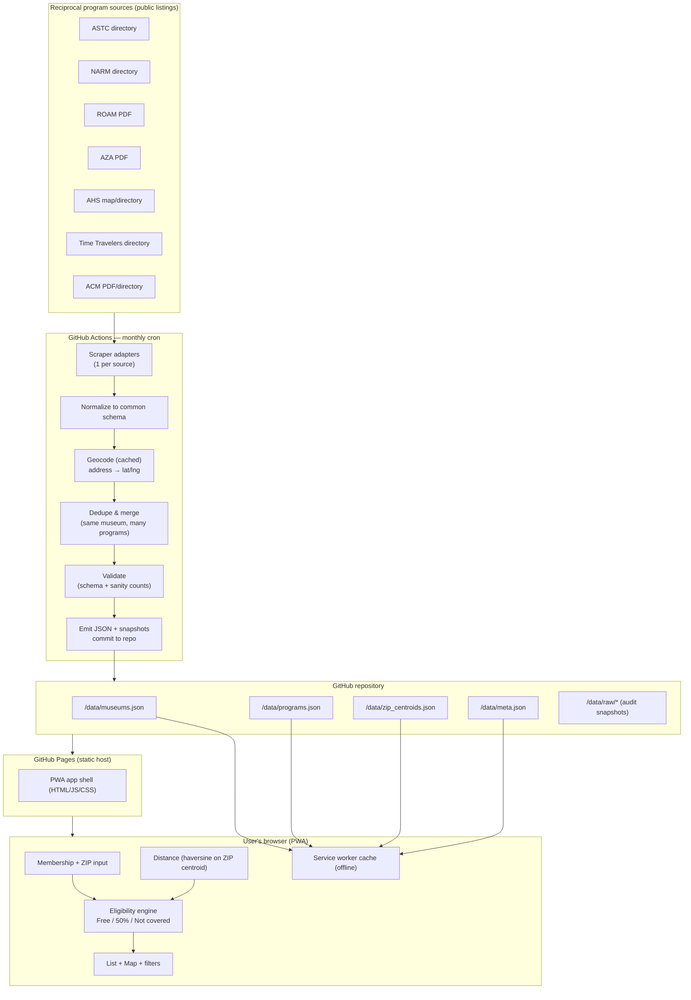

# Museum Reciprocal Finder — Architecture & Implementation Plan

*A static PWA, hosted on GitHub Pages, that tells a member which nearby museums they can enter free or at a discount, based on the reciprocal networks their membership belongs to.*

**Version:** 0.2 (adds new-user "gateway membership" flow, ZIP/exclusion handling, color-coded overlap results)
**Date:** 2026-09-22

> **Scope: personal use.** This is built primarily for one user. Favor the common path and curated data; deliberately **don't** engineer for every rare edge case. Where a rule is fuzzy, a "verify locally" label is good enough.

---

## 1. Locked decisions

| Decision | Choice | Consequence |
|---|---|---|
| Platform / hosting | **Static PWA on GitHub Pages** | No server, no DB, no API keys, **$0 running cost**. All logic runs in the browser. |
| Data sourcing | **Automated scraper + monthly GitHub Action** | Data is regenerated and committed to the repo on a schedule; the app just fetches static JSON. |
| Discount handling (v1) | **Classify only: Free / 50% (discount) / Not covered** | No dollar math in v1. Schema still reserves a price field for v2. |
| Role of ZIP | Drives **distance-exclusion rules**, not dollars | **Required** input — several programs exclude nearby institutions. |
| New-user entry | **"Cheapest gateway membership" recommender** | A user with *no* reciprocal membership is pointed to the lowest-cost membership that unlocks reciprocal access. |
| Overlap handling | **Color-code by association; recommend one when a museum is in several** | Recommend by best tier, then by party size (people admitted). |
| Scope | **Personal use — don't over-engineer edge cases** | Curated data acceptable; keep the engine lean. |
| Geographic scope | **US only (v1)** | ZIP/city datasets are US-only; skip Canada/PR/Bermuda for now. |
| Adapter build order | **ASTC + ACM first** | Well-documented rules; ACM is small & uniform 50%. |
| ToS posture | **Scrape, with a manual PDF-drop fallback** | Association-supplied PDFs can be dropped in a project folder and parsed by the same pipeline (§7.1). |
| Feature priority | **Free/discount finder first; arbitrage advisor next** | Advisor (gateway recommender) is wanted too, but ships after the finder. |
| Location input | **ZIP, city, or address** | A resolver turns any of these into coordinates (§5.3). |
| Deliverable | This Markdown design doc + system diagram | — |

---

## 2. Problem framing

Reciprocal networks let a member of one institution get free or discounted admission at *other* institutions in the same network. A single museum membership often bundles **several** networks at once (e.g. a mid-size art museum membership might include NARM + ROAM + ASTC). The user rarely knows which of the hundreds of far-flung institutions they can actually walk into for free.

The app answers, for a given user:

> "Here are the museums near (or anywhere) that **your** membership gets you into **free**, which give you **~50% off**, and which you're **not covered** for — accounting for the distance rules that block nearby institutions."

Three ways a user enters the app:

1. **By home museum** — "I'm a member of the *Nelson-Atkins Museum*." The app maps that to the networks it belongs to **and** uses its location as a distance anchor. (Most accurate.)
2. **By association** — "I have NARM and ASTC." No home-institution location is known, so only residence-based (ZIP) distance rules can be applied. (Less accurate; app surfaces a caveat.)
3. **No membership yet → gateway recommender** — the user holds nothing. The app asks for their home ZIP and (optionally) which museums they'd like to visit, then recommends the **cheapest membership that unlocks reciprocal access** — e.g. a low-cost regional museum whose membership bundles NARM/ROAM/etc. This is the "arbitrage" entry point: buy the smallest membership, unlock the biggest network. (See §6.2 and the `memberships.json` dataset in §5.5.)

**Home ZIP / address is a required input**, because the distance-exclusion rules (below) can't be evaluated without it. The app prompts for it up front.

---

## 3. Domain research — the seven programs

This is the foundation of the whole system. The critical, non-obvious finding: **benefit tier and distance rule are frequently set per-institution, not uniformly per program.** So the data model stores a benefit + exclusion *per museum, per program*, with program-level defaults as a fallback.

| Program | Full name | Typical benefit | Distance / exclusion rule | ~Size | How the member list is published |
|---|---|---|---|---|---|
| **ASTC** | Assoc. of Science & Technology Centers — Travel Passport | **Free** general admission | 90-mile rule, "as the crow flies": excluded if target is within 90 mi of the member's **home institution** OR within 90 mi of the member's **residence**; two institutions within 90 mi of each other are excluded unless mutually lifted | ~350+ | HTML directory (`astc.org`) + exclusions PDF |
| **NARM** | North American Reciprocal Museum Assoc. | **Free**/member admission (+ shop, lecture discounts) | Per-institution; commonly a **home-institution proximity** exclusion (~15 mi seen; some larger). Varies by museum | ~1,500+ | Searchable HTML directory (`narmassociation.org/members/`) |
| **ROAM** | Reciprocal Organization of Associated Museums | **Free** admission | **25-mile (40 km)** exclusion between member institutions | ~500+ | PDF list (Google Sites) |
| **AZA** | Assoc. of Zoos & Aquariums | **50%–free, set per institution** | Per-institution proximity exclusions (close institutions need not reciprocate) | ~230+ | Annual **PDF** (May–April cycle), `aza.org/reciprocity` |
| **AHS** | American Horticultural Society — Reciprocal Admissions Program (RAP) | **Free** admission | **Optional** 90-mile exclusion — each garden may apply it based on the membership card's address | ~350+ | Map / directory (`ahsgardening.org`) |
| **Time Travelers** | (run by Missouri Historical Society) | **Per institution**: free or reduced (+ shop, parking) | No central distance rule; each org sets terms | ~400+ | HTML directory (`timetravelers.mohistory.org`) |
| **ACM** | Assoc. of Children's Museums — Reciprocal Network | **50% off** general admission (up to 6 people; cardholder present) | **No 90-mile rule** | ~200 | Brochure PDF + directory (`findachildrensmuseum.org`, "R" flag) |
| **ANCA** | Assoc. of Nature Center Administrators — Reciprocal Program | **Per organization**: free admission, % admission discount, or store/program perks | Some organizations exclude visitors within **50 mi** (only stated for a few) | ~160 | HTML table (`natctr.org/membership/reciprocal-program`) |

**Design implications drawn directly from this table**

1. **Benefit is per-museum-per-program.** AZA and Time Travelers vary institution by institution; ACM is uniformly 50%; the rest are mostly free. Store the real value on each museum record, fall back to a program default only when unknown.
2. **Distance rules have two anchor points** — the member's *home institution* and the member's *residence (ZIP)* — plus an *inter-institution* variant. The engine must support all three. **Confirmed for ASTC: the exclusion is OR, not AND.** ASTC states you're eligible only at venues *outside 90 mi of your home institution **and** outside 90 mi of your primary residence* — so being within 90 mi of **either one** blocks you. Both must be >90 mi away to get in free. (This is why the app needs both your home museum's location and your home ZIP.)
3. **Rules are heterogeneous:** program-wide constants (ROAM 25 mi, ASTC 90 mi), per-institution values (NARM), and optional/discretionary (AHS, AZA). The schema encodes an exclusion object per program entry with a program-level default.
4. **Publication formats are mixed:** searchable HTML directories, PDFs, and a map. → one **scraper adapter per source**, including a PDF parser and (where needed) a headless browser.
5. **Everything is discretionary and changes.** The UI must always show a *last-updated* date and a **"call ahead to confirm"** disclaimer, and never *guarantee* entry.

> Sources for the above are listed in §13.

---

## 4. High-level architecture

Two completely decoupled halves that meet only at a folder of static JSON committed to the repo:

- **Build time (monthly, in GitHub Actions):** scrape → normalize → geocode → deduplicate/merge → validate → emit `museums.json`, `programs.json`, `zip_centroids.json`, `meta.json`.
- **Run time (in the user's browser):** load those JSON files once, cache offline via a service worker, and run the eligibility engine + distance math entirely client-side.



Why this shape fits the constraints: GitHub Pages only serves static files, so all *computation* is pushed to the client, and all *data freshness* is pushed to a scheduled Action. There is nothing to run, secure, or pay for between refreshes.

---

## 5. Data model

Three generated files plus one metadata file. All are plain JSON, versioned in the repo, and cacheable.

### 5.1 `programs.json` — program metadata & defaults

```jsonc
{
  "ASTC": {
    "name": "ASTC Travel Passport Program",
    "category": "science",
    "color": "#1f77b4",                     // used to color-code results in the UI (§6.3)
    "default_benefit": "free",              // fallback when a museum record lacks a value
    "default_admits": 2,                    // typical party size admitted (people); overridable per museum
    "default_exclusion": {
      "radius_mi": 90,
      "anchors": ["home_institution", "residence"],  // OR: within radius of EITHER blocks the benefit
      "measure": "straight_line",
      "discretionary": false                // false = always applies; true = museum may opt in
    },
    "source_url": "https://www.astc.org/...",
    "updated": "2026-09-01"
  },
  "ROAM":  { "color": "#2ca02c", "default_benefit": "free", "default_admits": 2, "default_exclusion": { "radius_mi": 25, "anchors": ["inter_institution"], "discretionary": false }, "...": "..." },
  "NARM":  { "color": "#9467bd", "default_benefit": "free", "default_admits": 2, "default_exclusion": { "radius_mi": 15, "anchors": ["home_institution"], "discretionary": true  }, "...": "..." },
  "AZA":   { "color": "#ff7f0e", "default_benefit": "discount_50", "default_admits": 2, "default_exclusion": { "anchors": ["inter_institution"], "discretionary": true }, "...": "..." },
  "AHS":   { "color": "#8c564b", "default_benefit": "free", "default_admits": 2, "default_exclusion": { "radius_mi": 90, "anchors": ["residence"], "discretionary": true }, "...": "..." },
  "TIMETRAVELERS": { "color": "#e377c2", "default_benefit": "varies", "default_admits": 2, "default_exclusion": null, "...": "..." },
  "ACM":   { "color": "#d62728", "default_benefit": "discount_50", "default_admits": 6, "default_exclusion": null, "...": "..." }  // ACM: 50% off up to 6 people, no distance rule
}
```

**Benefit vocabulary:** `free` · `discount_50` · `discount_other` (with a `percent`) · `varies` (resolve at museum level) · `none`.

### 5.2 `museums.json` — one record per *physical* institution

A single museum that belongs to several networks is **one** record with several program entries (this is what makes "best benefit across my memberships" possible and keeps the map clean).

```jsonc
{
  "id": "nelson-atkins-kansas-city-mo",     // stable slug
  "name": "The Nelson-Atkins Museum of Art",
  "aka": ["Nelson Atkins"],
  "type": "art",                            // art|science|zoo|aquarium|garden|children|history|other
  "address": "4525 Oak St, Kansas City, MO 64111",
  "city": "Kansas City", "state": "MO", "zip": "64111", "country": "US",
  "lat": 39.0454, "lng": -94.5807,          // geocoded at build time
  "website": "https://nelson-atkins.org",
  "programs": {
    "NARM": { "benefit": "free", "admits": 2, "exclusion": { "radius_mi": 15, "anchors": ["home_institution"] }, "notes": "", "verified": "2026-09" },
    "ROAM": { "benefit": "free", "admits": 2, "exclusion": null, "verified": "2026-09" }
  },
  "admission": { "adult": null, "currency": "USD", "asof": null },  // reserved for v2 pricing
  "sources": ["narm", "roam"],
  "last_seen": "2026-09-01"
}
```

Notes:
- `exclusion: null` on a program entry ⇒ use that program's `default_exclusion`.
- `admits` = how many people this program gets in (free/discounted) at this museum; falls back to the program's `default_admits`. Used to pick the best association on overlap (§6.3). *Real party size also depends on the user's home membership level, so treat this as a guide, not gospel — fine for personal use.*
- `admission` is intentionally present-but-empty so v2 pricing is a pure data change, no schema change.
- `verified` / `last_seen` power the freshness disclaimer and let validation flag stale records.

### 5.3 Location resolver — ZIP **or** city **or** address

The user can type any of three things to set their location (home, or "find museums near…"). The app resolves each to `{lat, lng}`:

- **ZIP** → `zip_centroids.json`: `{ "64111": [39.045, -94.583], ... }`, all US ZIPs (~42k). Source: US Census ZCTA gazetteer (public domain). Ships compressed (~0.5–1 MB gzipped). *Instant, offline.*
- **City/state** → `us_cities.json`: `{ "bakersfield, ca": [35.37, -119.02], ... }`, ~30k US places (US Census/SimpleMaps free). *Instant, offline.*
- **Full street address** → a runtime call to a free geocoder (US Census Geocoder, or Nominatim with attribution). Only used when the two local datasets don't resolve the input; volume is tiny for personal use, so no key/backend needed. Results cached in `localStorage`.

Resolution order: exact ZIP → city match → geocode. US-only in v1.

### 5.4 `meta.json`

`{ "last_updated": "2026-09-01", "counts": { "museums": 3187, "by_program": {...} }, "schema_version": 1 }` — drives the "data as of…" banner and the validation guardrail (§7.4).

### 5.5 `memberships.json` — gateway-membership catalog (for new users)

Powers the "no membership yet" flow (§6.2). One entry per museum that *sells* a reciprocal-granting membership, with its cheapest qualifying tier and which programs that tier unlocks. **A seeded starter version ships as `memberships.seed.json` (9 gateways, from prior project research — see §13 and `project-memory.md`).**

```jsonc
{
  "id": "carnegie-...-al",           // links to a museums.json record
  "name": "Carnegie Museum (example gateway)",
  "cheapest_reciprocal_tier": { "name": "Individual", "price": 45, "currency": "USD" },
  "unlocks": ["NARM", "ROAM"],       // programs granted at this tier
  "lat": 0, "lng": 0,
  "notes": "prices change — confirm on the museum site",
  "asof": "2026-09"
}
```

The recommender sorts candidates by `price` ascending, filtered to those whose `unlocks` cover the programs the user cares about (or simply the cheapest that unlocks the largest network). Membership *join* price is far easier to find than per-museum *admission* price, so this dataset is realistic to maintain even though v1 skips admission dollars.

---

## 6. Algorithms

### 6.1 Per-museum eligibility (the core)

Runs client-side. Inputs: the user's **held programs** (from their home museum(s) and/or directly-selected associations), the user's **home-institution locations** (if any), and the user's **residence ZIP** (required).

For each museum `M`, collect **every program the user could use there**, drop the excluded ones, then pick the best:

```
applicableOptions(M, user):
  options = []
  for each program P in intersect(M.programs, user.heldPrograms):
      entry   = M.programs[P]
      benefit = entry.benefit ?? programs[P].default_benefit
      if benefit == "varies": benefit = "verify"        # can't assert; show as check-locally
      admits  = entry.admits  ?? programs[P].default_admits
      excl    = entry.exclusion ?? programs[P].default_exclusion

      if excl and isExcluded(M, user, excl):
          continue                                       # this program is blocked here
      options.push({ program: P, benefit, admits, color: programs[P].color })
  return options                                          # may be 0, 1, or several (overlap)
```

```
isExcluded(M, user, excl):
  if excl.discretionary and not entry.exclusion:        # optional rule, museum didn't opt in
      return false
  r = excl.radius_mi
  for anchor in excl.anchors:
      if anchor == "home_institution":
          for H in user.homeInstitutions:               # only if user picked specific museum(s)
              if H grants P and distance(M, H) < r: return true
      if anchor == "residence" and user.zip:
          if distance(M, user.zipCentroid) < r: return true
      if anchor == "inter_institution":                 # M within r of any home institution granting P
          for H in user.homeInstitutions where H grants P:
              if distance(M, H) < r: return true
  return false

distance(a, b) = haversine(a.lat/lng, b.lat/lng)         # straight-line, matches "as the crow flies"
```

> **Exclusion is OR across anchors** — `isExcluded` returns true on the *first* anchor within the radius. That's exactly the confirmed ASTC rule: within 90 mi of home institution **or** residence ⇒ blocked.

**Output classification per museum** (from the best of `applicableOptions`)
- **FREE** — best tier is `free`.
- **DISCOUNT (~50%)** — best tier is `discount_50` / `discount_other`.
- **VERIFY** — covered by a `varies` program with no explicit benefit (Time Travelers, some AZA). Shown as "likely free/discount — confirm."
- **NOT COVERED** — either the user shares no program with `M`, *or* every shared program is distance-excluded. The UI distinguishes these two ("outside your networks" vs "too close to home").

**Important edge cases (baked into the design)**
- **Association-only selection** (no home museum): `home_institution` / `inter_institution` anchors can't be evaluated → only `residence` rules apply, and results carry a caveat that nearby-institution exclusions can't be checked. This is *why* picking a specific home museum yields better answers.
- **The user's own home museum** is labeled "Your museum," not a result.
- **No ZIP given:** residence rules are skipped; app still returns home-institution/inter-institution results and nudges the user to add a ZIP for accuracy.
- **`verify` never masquerades as a guarantee** — always paired with the call-ahead note.

Performance: with a few thousand museums, brute-force haversine in JS is <10 ms; no spatial index needed in v1. (A geohash grid is a v2 optimization if the dataset grows.)

### 6.2 Overlap → recommended association

When `applicableOptions(M, user)` returns **more than one** program (the museum is in several networks the user holds), the UI shows *all* of them as color-coded chips **and** flags one as recommended:

```
recommendedOption(options):
  return options.sortBy(
     tierRank(benefit) DESC,     # free > discount_50 > discount_other > verify
     admits DESC,                # tie-break: the one that gets the most people in
     stableProgramOrder          # final tie-break for determinism
  )[0]
```

So a free-admission network always beats a 50% one; when two are both free, the one admitting more people wins. Example: a children's museum in both **NARM** (free, admits 2) and **ACM** (50% off, admits 6) → recommend **NARM** for the cardholder, but the UI still shows the ACM chip because a family of 6 might prefer it. (v1 doesn't do the dollar comparison; it just surfaces both — dollar-aware ranking is a v2 job once admission prices exist.)

### 6.3 Gateway-membership recommender (new user, no membership)

For the "no membership yet" entry path:

```
recommendGateway(user):
  candidates = memberships.json
  if user.wishlist:                                   # museums they want to visit
      score each candidate by how many wishlist museums its `unlocks` programs cover
      rank by (coverage DESC, price ASC)
  else:
      rank by (networkReach DESC, price ASC)          # cheapest that unlocks the biggest network
  return top few, each showing price + which programs it unlocks
```

This is the literal "arbitrage": pay the smallest membership fee that unlocks the most reciprocal access near the user's location (ZIP/city/address). Output feeds straight into §6.1 as if the user now held those programs, so they can preview what a purchase would unlock before buying.

---

## 7. Data pipeline (build time)

### 7.1 Scraper adapters — one per source

**Build order (agreed): ASTC first, then ACM**, then the rest as needed. ASTC publishes an authoritative participant-list PDF (e.g. `astc.org/wp-content/uploads/2026/04/Standard-List-11pt-Font.pdf`, refreshed each May); ACM is small and uniformly 50%, so it's a quick, high-signal second. NARM/ROAM/AZA/AHS/Time Travelers follow.

Each adapter's contract: get the source → emit records in the **common schema** (§5.2) tagged with its program. Three source kinds plus a manual fallback:
- **HTML directory** (NARM, ACM, Time Travelers; ASTC also has one): first look for an underlying JSON/XHR endpoint the page calls (cleanest, most stable); fall back to HTML parsing (BeautifulSoup); fall back to a headless browser (Playwright) only if the list is JS-rendered.
- **PDF** (ASTC participant list, ROAM, AZA reciprocity list, ACM brochure): parse with `pdfplumber`/`tabula`; PDFs are messy, so each gets targeted row-extraction logic + a golden-sample test.
- **Map** (AHS): the map almost certainly loads a GeoJSON/JSON feed — capture that endpoint rather than scraping tiles.
- **Manual drop (`/pipeline/manual_drops/<program>/`)**: you can drop an **association-supplied PDF/CSV** of participating institutions into this folder, and the pipeline parses it exactly like a scraped source. This is the ToS-safe path: for any association whose terms discourage scraping (or whose site keeps breaking), hand-place their official list and skip the scraper. A manifest (`manual_drops/index.json`) records which program/date each file covers, and a manual drop **overrides** the scraper for that program+month.

Raw responses (and copies of manual drops) are saved to `/data/raw/<source>/<date>` and committed, giving an audit trail and letting us diff month-over-month to catch silent format changes.

### 7.2 Geocoding (cached)
Many listings have an address but no coordinates. Geocode via the **US Census Geocoder** (free, US) with **Nominatim/OSM** as fallback, honoring rate limits. Results are cached in `/pipeline/geocode_cache.json` keyed by normalized address, so each monthly run only geocodes *new* addresses. Coordinates are baked into `museums.json` — the client never geocodes.

### 7.3 Deduplicate & merge
The same physical museum recurs across programs. Merge by normalized name + geographic proximity (e.g. `rapidfuzz` name similarity within ~200 m). Ambiguous merges are resolved by a hand-maintained `/pipeline/overrides.json` (canonical IDs, forced splits/merges). Output: one record per museum with a combined `programs` map.

### 7.4 Validate (guardrail)
Before publishing: JSON-schema check every record; assert per-program counts are within a tolerance of last month (e.g. **fail the run if any program's count drops >25%** — the classic symptom of a broken selector or a changed PDF). On failure the Action opens an issue / notifies and does **not** overwrite good data.

### 7.5 Orchestration
```yaml
# .github/workflows/update-data.yml  (sketch)
on:
  schedule: [{ cron: "0 6 1 * *" }]   # 06:00 UTC on the 1st of each month
  workflow_dispatch: {}                # manual trigger
jobs:
  refresh:
    steps:
      - run scrapers (all adapters)
      - normalize -> geocode (cached) -> dedupe -> validate
      - if valid: write /data/*.json, commit, push
      - on failure: open issue, keep previous data
```
A second workflow (`deploy.yml`) builds the PWA and deploys to Pages on push to `main`.

---

## 8. The PWA (run time)

**Screens**
0. **Onboarding** — pick one of the three entry paths (§2): *I'm a member of a museum* / *I have these associations* / *I don't have a membership yet*. **Home ZIP or address is required** on every path (needed for the 90-mile rule); home-museum path also captures the museum's location.
1. **My Membership** — autocomplete to add home museum(s) *and/or* toggle associations directly; a **location field that accepts ZIP, city, or address** (§5.3). Persisted in `localStorage`.
2. **Results (given a location)** — list of museums, each showing **color-coded association chips** (one color per program, see `programs.json.color`) and a **Free / ~50% / Verify / Not-covered** badge. When a museum is in several of your networks (overlap), the **recommended association is highlighted** (best tier, then most people admitted — §6.2); other applicable chips stay visible. Filters by type, program, radius; sort by distance.
3. **Map** — same results as pins (MapLibre GL + OSM tiles, no API key); pin color = recommended association, badge = tier.
4. **Museum detail** — each applicable program with its benefit, admit count, and exclusion reason if blocked; the recommended one marked; website link; **"call ahead to confirm"** disclaimer.
5. **Gateway recommender** — for the no-membership path: shows the cheapest membership(s) that unlock the most reciprocal access near the ZIP (§6.3), with a "preview what this unlocks" that runs the results as if purchased.
6. **About / Data freshness** — "Data as of `meta.last_updated`," sources, and limitations.

**Offline & install:** service worker (Workbox via `vite-plugin-pwa`) precaches the app shell and the data JSON, so the app works offline after first load and is installable on Android/desktop. Data refreshes opportunistically when online.

**No storage of anything sensitive:** memberships + ZIP live only in `localStorage` on the device.

---

## 9. Recommended tech stack

| Layer | Choice | Why |
|---|---|---|
| Frontend | **React + Vite + TypeScript**, Tailwind | Fast static build, typed schema, easy Pages deploy |
| Search | **Fuse.js** | Client-side fuzzy museum autocomplete |
| Map | **MapLibre GL** + OSM tiles | Free, no token, works on static host |
| PWA | **vite-plugin-pwa (Workbox)** | Offline + installable with minimal config |
| Pipeline | **Python**: requests, BeautifulSoup, pdfplumber, Playwright (only where needed), pandas, rapidfuzz | Covers HTML, PDF, JS, dedupe |
| Geocoding | US Census Geocoder (+ Nominatim fallback), cached | Free, US-first |
| CI/CD | **GitHub Actions** (monthly cron + deploy), **GitHub Pages** | Zero cost, matches "hosted on GitHub" |

Everything above is free and static-host-compatible; there is no backend, database, or secret to manage.

---

## 10. Repository layout

```
museum-reciprocal-finder/
├─ app/                       # PWA frontend (Vite)
│  ├─ src/
│  │  ├─ engine/              # eligibility + distance (pure, unit-tested)
│  │  ├─ screens/  components/ store/
│  │  └─ main.tsx
│  └─ public/
├─ pipeline/                  # Python build
│  ├─ adapters/               # astc.py narm.py roam.py aza.py ahs.py timetravelers.py acm.py
│  ├─ normalize.py geocode.py dedupe.py validate.py build.py
│  ├─ geocode_cache.json  overrides.json
│  └─ tests/                  # golden-sample tests per adapter
├─ data/                      # generated, committed
│  ├─ museums.json programs.json zip_centroids.json meta.json
│  └─ raw/                    # per-source monthly snapshots (audit)
├─ .github/workflows/
│  ├─ update-data.yml         # monthly scrape + validate + commit
│  └─ deploy.yml              # build + deploy to Pages
├─ ARCHITECTURE.md  README.md
```

The **eligibility engine is a pure, dependency-free module** with its own unit tests (a table of fixture users × museums × expected tiers). It's the highest-risk logic, so it's isolated and testable without the UI.

---

## 11. Roadmap (personal-use pace)

**Phase 0 — Data spike (de-risk first).** Manually pull one page/PDF from each of the 7 sources; confirm each can be parsed and geocoded; hand-build a ~100-museum `museums.json` **plus a small `memberships.json`** of known cheap gateways. *Goal: prove the data is obtainable before building anything.*

**Phase 1 — MVP.** Eligibility engine + unit tests; the three entry paths (home museum / associations / **gateway recommender**); required ZIP; results list with color-coded association chips + Free/50%/Verify/Not-covered badges and the recommended-association highlight. Static hand-checked data. Deploy to Pages.

**Phase 2 — Automated pipeline.** Real adapters for the sources you actually use; geocoding cache; dedupe; validation guardrail; monthly Action. (For personal use, it's fine to automate only the high-value sources and hand-curate the rest.)

**Phase 3 — PWA polish.** Map view, offline/install, filters, freshness banner.

**Phase 4 — Nice-to-haves.**
- **Admission pricing** → real dollar amounts for the 50% cases, enabling dollar-aware ranking on overlap.
- **Cross-border** (Canada/PR postal centroids) if you want the non-US NARM/ROAM institutions.
- Trip planner / share links.

## 12. Risks & mitigations

*Since this is for personal use, the biggest ones are the top two rows; the rest can be handled lightly (curate by hand, add a disclaimer) rather than fully engineered.*

| Risk | Impact | Mitigation |
|---|---|---|
| **Terms of Service / robots.txt** on member directories | Scraping may be disallowed | Check robots.txt/ToS before enabling an adapter; low request rate + monthly cadence + caching. **Primary fallback: the manual PDF/CSV drop folder (§7.1)** — place the association's own supplied list and skip scraping entirely for that program. |
| **Policies are discretionary & change** | App could mislead a user | Never guarantee; always show benefit as "as of <date>" + prominent **"call ahead to confirm"**; `verify` tier for anything uncertain |
| **JS-rendered / anti-bot pages** | Adapter breaks | Prefer hidden JSON endpoints; Playwright fallback; validation guardrail (§7.4) catches silent breakage and preserves last-good data |
| **Distance rules not machine-readable per museum** | Wrong Free/excluded call | Program defaults + explicit per-museum overrides where stated; mark the rest `discretionary`/`verify`; caveat when home-institution location is unknown |
| **Dedup errors** merging distinct museums | Wrong program bundling | Geo+name fuzzy match with a hand-maintained overrides file; diff review month-over-month |
| **Liability of "free" claims** | User denied entry | Framing throughout as guidance, plus disclaimer; store & show source + date |

---

## 13. Decisions resolved + what's left

**Resolved this round**
- **Geographic scope:** US only for v1.
- **Adapter order:** ASTC + ACM first, rest later.
- **ToS:** scrape where clean, but the manual PDF/CSV drop folder (§7.1) is a first-class path for association-supplied lists.
- **Priority:** build the free/discount finder first; the gateway/arbitrage advisor comes next (both are wanted).
- **Location input:** accept ZIP, city, or address.
- **Gateway data:** seeded — see `memberships.seed.json` (9 gateways) and `project-memory.md`.

**Still open (low urgency, personal-use)**
1. **Verify seed prices** — several `memberships.seed.json` entries are marked `approx`/`verify`; reconfirm on museum sites before trusting the dollar figures.
2. **Pin down the "Carnegie (IN)" gateway** referenced in prior research (Dennos is seeded as the concrete ASTC+NARM+ROAM ~$100 option).
3. **Prefill your own profile?** Your current memberships (MoS Boston, Indiana State, Please Touch, New Britain) are recorded in `project-memory.md` — say the word and the app can ship with them as the default membership set.

## 14. Sources

- ASTC Passport Program FAQ & benefits — https://www.astc.org/membership/find-an-astc-member/passport-faq/ · https://assets.speakcdn.com/assets/2039/understanding_your_passport_benefits.pdf
- NARM Association (members directory & rules) — https://narmassociation.org/members/ · https://en.wikipedia.org/wiki/North_American_Reciprocal_Museum_Association
- ROAM (about & member list) — https://sites.google.com/site/roammuseums/home
- AZA Reciprocal Admissions — https://www.aza.org/reciprocity/
- AHS Reciprocal Admissions Program / Garden Network — https://ahsgardening.org/ahs-garden-network/
- Time Travelers — https://timetravelers.mohistory.org/
- ACM Reciprocal Network — https://findachildrensmuseum.org/reciprocal-network/
